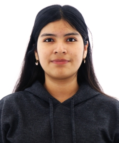

# Equipo 12 - Fundamentos de Diseño
### Carrera de Ingeniería Ambiental / Informática / Industrial  
**Universidad Peruana Cayetano Heredia**

---

## 🌍 Descripción del Equipo  
Somos el **Equipo 12** del curso **Fundamentos de Diseño 2026-1**, integrado por estudiantes de las carreras de Ingeniería Ambiental, Ingeniería Informática e Ingeniería Industrial. Nos une un mismo objetivo: crear soluciones innovadoras que generen un impacto real en la sociedad y el medio ambiente, aplicando la metodología de diseño.

Nos interesa trabajar en los siguientes **Objetivos de Desarrollo Sostenible (ODS)**:
- ODS 3: Salud y Bienestar
- ODS 6: Agua Limpia y Saneamiento
  

Porque el acceso a agua segura mejora la salud y previene enfermedades. Al trabajar estos objetivos, buscamos mejorar la calidad de vida y proteger el ambiente.

---

## 📸 Fotografía del Equipo  

  <em>Figura 1. Fotografía del equipo 12</em>

---

## 👥 Integrantes del Equipo  

| Foto | Nombre | Rol | Intereses |
|------|--------|-----|-----------|
|  | **Ariana Cortéz** | Líder del equipo | Innovación social, sostenibilidad. |
|  | **Luis Huaccha** | Responsable de investigación | Gestión ambiental, desarrollo comunitario. |
|  | **Dulce Huicho** | Diseñadora | Diseño de prototipos, creatividad visual y enfoque ambiental. |
|  | **Claudiana Pineda** | Encargada de documentación | Comunicación científica, redacción técnica. |
|  | **Giacomo Jimenez** | Programador - Modelador | Programación, análisis de datos, simulación. |

---

## 📌 Resumen Final  
Este README describe de manera clara la identidad del equipo, sus motivaciones y los Objetivos de Desarrollo Sostenible (ODS) en los que se centrará el trabajo a lo largo del curso. 
